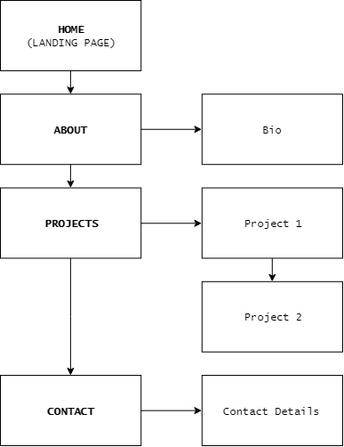

https://ugkid.github.io/

[GitHub repository](https://github.com/ugkid/webportfolio)
## Michael Bahari's Portfolio Website
### Purpose
The purpose of this website was to create a portfolio for my web development work. I wanted to apply a personal brand identity that represented myself. This website was designed and developed in a way that I could manage and reiterate for at least a few years.
### Features
The website features a single vertical page and a navigation button. It is divided into 4 sections: Home, About, Projects and Contact. 
I chose to use a single page so that all the content could be read sequentially from top to bottom. 
The function of the navigation button is to toggle a menu between being collapsed behind the button or displayed/overlayed on the screen. Its aim is to provide direct navigational access to the sections of the page.   
### Sitemap

### Screenshots
### Target audience
The target audience are future employers, clients and fellow web developers and designers. 
### Tech stack
HTML, CSS, Javascript and Adobe XD.
## Design Documentation
### Design Process
### Wireframes

### Usability Considerations
I wanted the user to access all sections quickly. Rather than having multiple links to go to different pages/sections, I placed everything on a single page so that the user can scroll down. I tried to mimic the experience of reading an article. More and more mobile devices are increasing in screen size so I wanted to design my UI elements for 'thumbs'. The navigation button was placed deliberately in the bottom right corner so it could easily be reached. The button is a bold black square as opposed to the traditional 'hamburger' icon. I also provided ALT text in all of my images for web accessibility. 
## Planning Process
### Project Plan & Timeline
I planned to finish moodboarding and rough concepts by Monday, finalize styles(typography, colors, layout) by Tuesday, work on developing the CSS on Wednesday and Thursday, Javascript and touches on Friday, and the documentation on the weekend. 
### Screenshots Of Trello Boards
## 

Details of planning process including,
Project plan & timeline
Screenshots of Trello board(s)
Short Answer Q&A - Include short answers to the following questions,
Describe key events in the development of the internet from the 1980s to today (max. 150 words)
Define and describes the relationship between fundamental aspects of the internet such as: domains, web servers, DNS, and web browsers (max. 150 words)
Reflect on one aspect of the development of internet technologies and how it has contributed to the world today (max. 150 words)
