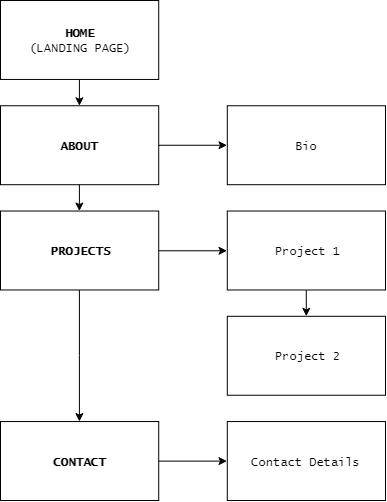
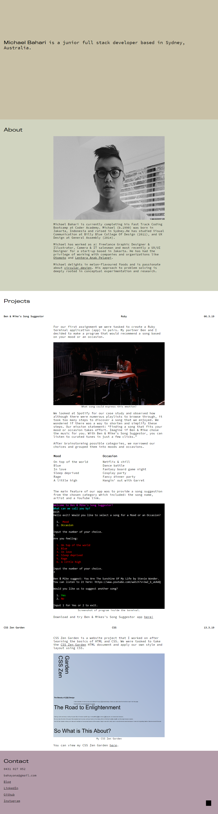
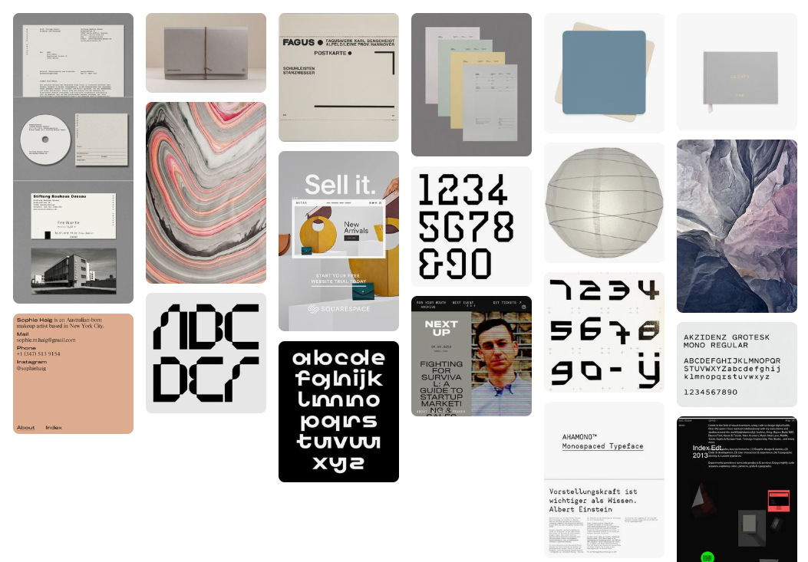
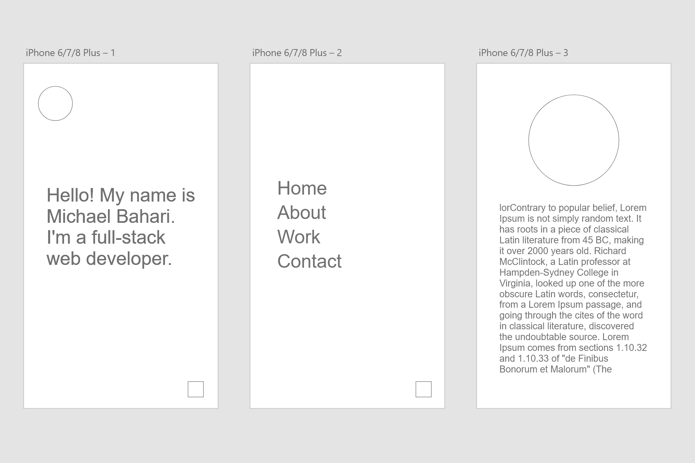
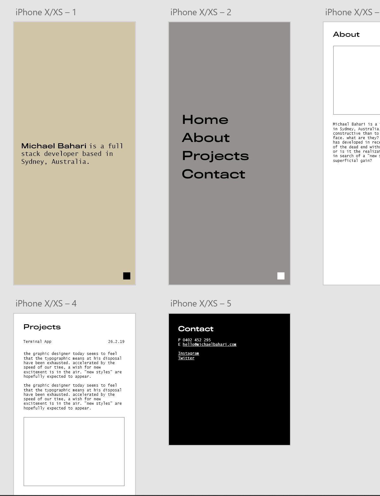
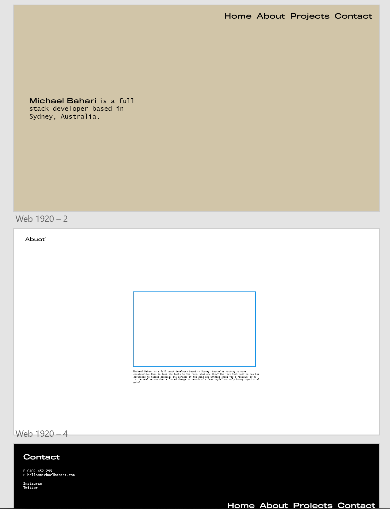
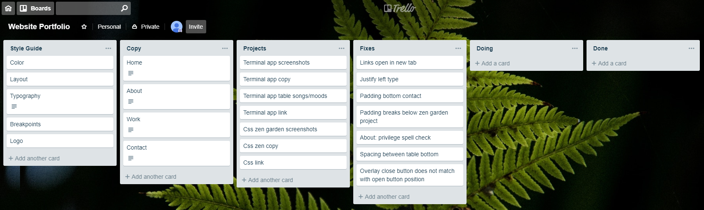

https://ugkid.github.io/

[GitHub repository](https://github.com/ugkid/webportfolio)
## Michael Bahari's Portfolio Website
### Purpose
The purpose of this website was to create a portfolio for my web development work. I wanted to apply a personal brand identity that represented myself. This website was designed and developed in a way that I could manage and reiterate for at least a few years.
### Features
The website features a single vertical page and a navigation button. It is divided into 4 sections: Home, About, Projects and Contact. 
I chose to use a single page so that all the content could be read sequentially from top to bottom. 
The function of the navigation button is to toggle a menu between being collapsed behind the button or displayed/overlayed on the screen. Its aim is to provide direct navigational access to the sections of the page.   
### Sitemap

### Screenshots

### Target audience
The target audience are future employers, clients and fellow web developers and designers. 
### Tech stack
HTML, CSS, Javascript and Adobe XD.
## Design Documentation

### Design Process

### Wireframes

### Usability Considerations
I wanted the user to access all sections quickly. Rather than having multiple links to go to different pages/sections, I placed everything on a single page so that the user can scroll down. I tried to mimic the experience of reading an article. More and more mobile devices are increasing in screen size so I wanted to design my UI elements for 'thumbs'. The navigation button was placed deliberately in the bottom right corner so it could easily be reached. The button is a bold black square as opposed to the traditional 'hamburger' icon. I also provided ALT text in all of my images for web accessibility. 
## Planning Process
### Project Plan & Timeline
I planned to finish moodboarding and rough concepts by Monday, finalize styles(typography, colors, layout) by Tuesday, work on developing the CSS on Wednesday and Thursday, Javascript and touches on Friday, and the documentation on the weekend. 
### Screenshots Of Trello Boards

## Short Answer Q&A
Q1. In the early 1970s Bob Kahn and Vint Cerf began working on the design of what we call today as the 'Internet'. It was based on a previous defense department project called the 'ARPANET'(Advanced Research Projects Agency Network), which was a communication system that was designed to survive a nuclear attack. The nationwide experimental packet network that distributed information through a mesh network worked and from 1983 a standard internet working protocol was made and it became known as the internet. Today the internet is network or networks. It has become a vast network of shared information. 

Q2. All devices on the internet have unique addresses which are an organised series of numbers. Just like when you mail a physical letter to somebody overseas, you need write their mailing address properly so it can get delivered. Devices on the internet have a similar addressing system called an IP address. The Domain Name System (DNS) associates names like www.google.com with their addresses. A computer can look up domain names and their IP addresses so that you can connect to the desired place on the internet. A webrowser is like a window that lets you view content from another place on the internet. 

Q3. The internet has provided free education to many 3rd world countries in the world. The mass production of cheaper laptops for e.g. have allowed young children in remote and impoverished areas to learn knowledge. 
